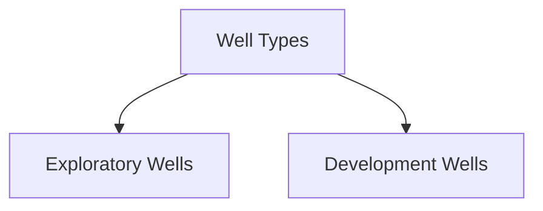

# Well Type
## Well Type Selection

```mermaid
flowchart TD
    A[Well Types] --> B[Exploratory Wells]
    A --> C[Development Wells]
```
[Exploratory Wells](./01_Well_Type/02_Exploratory_Wells.md)

[Development Wells](./01_Well_Type/03_Development_Wells.md)
