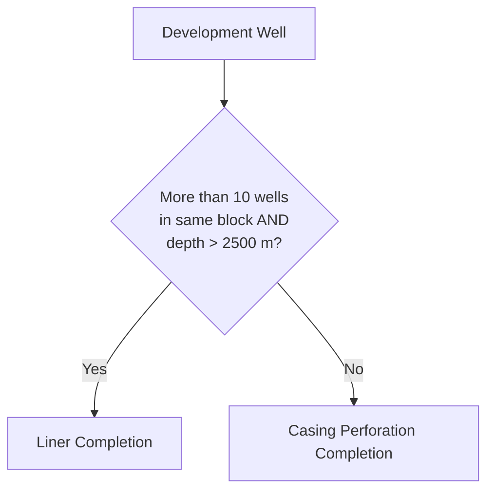

## Development Well

```mermaid
flowchart TD
    A[Development Well] --> B{More than 10 wells<br/>in same block AND<br/>depth > 2500 m?}
    B -->|Yes| C[Liner Completion]
    B -->|No| D[Casing Perforation Completion]
```
- [Liner Completion](../Development_Wells/Liner_Completion.md)
- [Casing Perforation Completion](../Development_Wells/Casing_Perforation_Completion.md)
