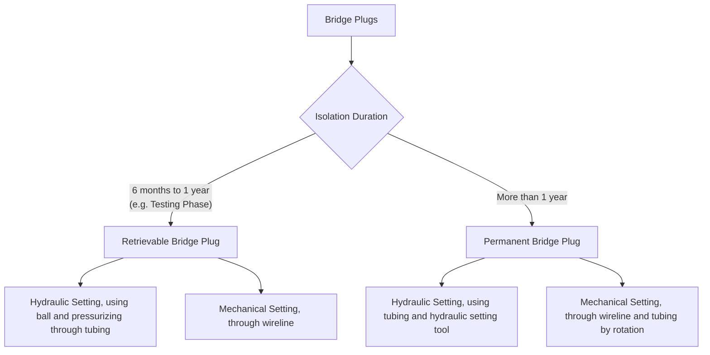

# For Casing Completion (5 1/2")
## We do Wireline Perforation Because we know the formation pressure
#### Mud weight needed to displace mud before perforating and well volume calculation 
[Open the Calculator](https://nemo180403.github.io/Well-Completion-Selection-Job-Planning-Decision-System/Development_Wells/calculator.html)
### **After the perforation Run in hole tubing keeping the Bell bottom shoe 5 m above the perforation (In my case We have 2 7/8" N80 6.5 PPF EUE threaded tubing).
## *Now further if you want to isolate the perforated zone we use bridge plug. Now Bridge plug we use come with different types (depending on setting procedure and duration of isolation).

